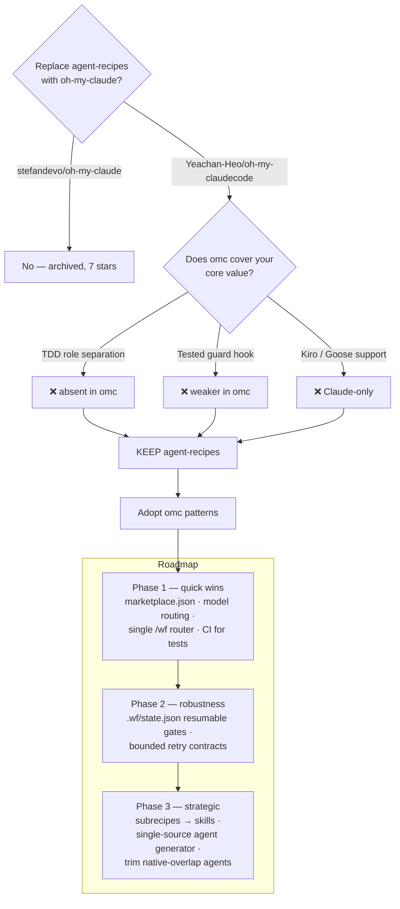
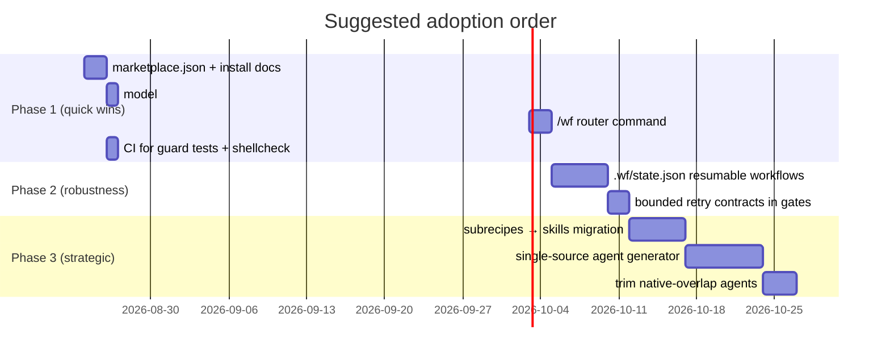

# agent-recipes vs. Oh My Claude — comparison & improvement plan

**Date:** 2026-08-23
**Verdict: keep agent-recipes, do not replace it. Adopt 5–6 specific ideas from oh-my-claudecode (omc), and optionally run omc side-by-side as a plugin to evaluate its execution modes.**

---

## 1. Which "Oh My Claude"?

The name is overloaded. Three projects match:

| Project | Stars | Status | What it is |
|---------|-------|--------|------------|
| [Yeachan-Heo/oh-my-claudecode](https://github.com/Yeachan-Heo/oh-my-claudecode) (**omc**) | ~39k | **Active**, 3.5k+ commits | Full multi-agent orchestration *platform*: execution modes, state persistence, model routing, HUD |
| [stefandevo/oh-my-claude](https://github.com/stefandevo/oh-my-claude) | 7 | **Archived June 2026** | Port of oh-my-opencode (Sisyphus/Prometheus agents) — dead end, do not adopt |
| [TechDufus/oh-my-claude](https://github.com/TechDufus/oh-my-claude) | small | niche | Just an "ultrawork" prompt trigger |

This document compares against **omc**, the only one that is a serious candidate.

---

## 2. Head-to-head

| Dimension | agent-recipes (this repo) | oh-my-claudecode (omc) |
|-----------|---------------------------|------------------------|
| **Nature** | Curated *content*: 30 agents + 16 evidence-gated `/wf-*` workflows encoding YOUR standards (TDD role separation, severity scale, §1–§9 conventions) | Orchestration *engine*: modes (team, autopilot, ralph, ultrawork, ultraqa, pipeline) that route generic agents |
| **Platforms** | Claude Code + Kiro + Goose | Claude Code only |
| **TDD** | First-class: test author ≠ implementer, enforced per workflow | Optional edit-blocking; not a design center |
| **Gates** | Evidence-gated: sees tests go red/green, BLOCK-on-inconclusive | Verify/fix loops (ralph, ultraqa) — persistence rather than evidence semantics |
| **Cross-session state** | `.wf/` handoff files only; a workflow does not survive session end | `.omc/sessions/`, replay logs, PreCompact snapshots — resumable |
| **Model/cost routing** | None — every agent runs at session model | Automatic tier routing (haiku ↔ opus), claims 30–50% token savings |
| **Safety** | Autonomous mode + tested PreToolUse guard (51 assertions) — genuinely stronger than omc's "trust mode" | Trust mode = broad auto-approval, less scrutiny |
| **Distribution** | `--plugin-dir` path or copy-install via setup.sh | Plugin marketplace + npm CLI — one-command install |
| **Domain fit** | Tailored: Python/Rust/Flutter/PostgreSQL, ML (MLflow, arXiv), Asana sync | Generic |
| **Maintenance** | You | Large active community |

### Why "replace" is the wrong frame

The two are not substitutes. omc replaces *how tasks get orchestrated*; agent-recipes encodes *what good work looks like* (your conventions, your gates, your stack). Dropping agent-recipes for omc would lose:

1. **TDD role separation** — omc has nothing equivalent to the test-architect/implementer split.
2. **The guard hook** — your deny-side security model is better engineered and better tested than omc's permissive trust mode.
3. **Kiro + Goose renderings** — omc is Claude-only.
4. **Your domain agents** — postgresql-expert, ai-researcher w/ PRISMA + citation graphs, asana-sync, MLflow tracking.
5. **Evidence-gated semantics** — "BLOCK (inconclusive) if any analyzer failed to run" is a stronger contract than "loop until green."

Also relevant: Claude Code itself has been absorbing orchestration features (native Workflow tool, agent teams, `/code-review ultra`, built-in Explore/Plan agents). Betting the farm on a third-party orchestration layer means absorbing its churn *and* the native platform's churn simultaneously.

---

## 3. What omc does better — and what to adopt

Prioritized. Items 1–3 are high-value/low-effort; 4–6 are larger.

### 3.1 Plugin marketplace distribution (small)
You already have `claude/.claude-plugin/plugin.json`. Add a `marketplace.json` at repo root so install becomes:

```
/plugin marketplace add wojciechkpl/agent-recipes
/plugin install agent-recipes
```

instead of cloning + `--plugin-dir` absolute path. This is omc's single biggest adoption lever and it costs you an afternoon.

### 3.2 Model routing in agent frontmatter (small)
Pin cheap models on mechanical agents and reserve strong models for reasoning:

| Agent | Suggested `model:` |
|-------|--------------------|
| language-detection, static-analysis, git-best-practices | `haiku` |
| code-reviewer, debugger, language experts | inherit (session default) |
| architect, ai-researcher, security-auditor | `opus` (or inherit) |

Directly addresses omc's 30–50% token-savings claim with a one-line frontmatter change per agent.

### 3.3 A single `/wf` router command (small)
omc's core UX insight is *zero learning curve*. 16 `/wf-*` commands is a memorization burden. Add one `/wf <task>` dispatcher command whose prompt classifies the task and invokes the right workflow (or names it and asks). Keep the explicit commands for power use.

### 3.4 Resumable workflow state (medium)
Your `.wf/` files hand off *artifacts* between workflows but a workflow run itself dies with the session. Borrow omc's boulder/session pattern:

- Write `.wf/state.json` at every gate: `{workflow, phase, gate_results, next_action}`.
- Each `/wf-*` command starts by checking for an in-progress state file and offers to resume.
- Optionally a PreCompact-style note in the workflow prompt: re-read `.wf/state.json` after any context compaction.

This converts your gates from "strong within a session" to "strong, period."

### 3.5 Ralph-style bounded persistence (medium)
Your gates loop, but no workflow states its retry contract. Add to each gated phase: *max N fix iterations, then STOP and report* — the discipline of omc's ralph/ultraqa without the "never surrender" failure mode (infinite loops burning tokens). E.g. GREEN phase: at most 3 implementer iterations before escalating to the human with the failure history.

### 3.6 Skill extraction (medium, strategic)
Your `subrecipes/` (tdd-generic, static-analysis, language-detection) are agents being used as shared libraries. Claude Code's native **skills** are now the right primitive for that: auto-triggering, loadable into any agent's context, no dispatch overhead. Migrating subrecipes → `claude/skills/` mirrors omc's `/skillify` direction and reduces agent-count sprawl.

### Not worth adopting
- **HUD statusline / cost dashboards** — nice demo, low value for a single-user toolkit.
- **Notification hooks (Telegram/Discord)** — you have Asana sync, which is your actual system of record.
- **npm CLI wrapper** — plugin marketplace covers distribution.
- **Cross-provider synthesis (`/ccg`)** — high maintenance, marginal gain.

---

## 4. Improvements independent of omc

1. **Single source of truth for agents.** 30 agents × 3 platforms = 90 files to keep in sync by hand, and the catalogs in three READMEs on top. Consider one canonical YAML per agent + a small generator emitting `.md` (Claude), `.json` (Kiro), `.yaml` (Goose). Alternatively — decide honestly whether Kiro/Goose renderings still earn their maintenance cost, and if not, freeze them with a "generated snapshots, Claude is canonical" note.
2. **Trim agents that native Claude Code now covers.** `analyst` overlaps the built-in Explore agent; `/wf-pre-pr`'s review leg overlaps `/code-review`; `/wf-fanout` overlaps the native Workflow tool. Where the native feature is strictly better, make your version a thin wrapper that adds only your gates/severity scale, or retire it.
3. **CI for the tests you already have.** `tests/*.sh` exist but nothing runs them on PR. A 10-line GitHub Actions workflow (shellcheck + both test scripts) protects the guard hook — your most safety-critical code — from regressions.
4. **Add a `bats`/shellcheck pass over `setup.sh`, `autonomous-mode.sh`, `guard.sh`** — you enforce defensive scripting via bash-expert; apply it to your own scripts in CI.

---

## 5. Optional: evaluate omc side-by-side

You can trial omc without commitment — install it as a *plugin* next to agent-recipes and try `/ralph` and `/team` modes on a real task for a week.

**Caveats:**
- omc's `/setup` writes hooks and settings; your autonomous mode also owns `~/.claude/settings.json` (with its own backup/restore lifecycle). Run omc **project-scoped in a scratch repo first**, and check its trust mode doesn't blanket-allow what your guard exists to deny.
- If both wire PreToolUse hooks, verify ordering: your guard must still fire.

If after trial you love an omc mode, the play is still *adopt the pattern into a `/wf-*` command* (per §3), not replace the repo.

---

## 6. Decision & roadmap

> **Status (2026-08-23): Phases 1 and 2 implemented.** Phase 2: a uniform
> **"Run state & bounded retries"** protocol appended to all 16 `wf-*.md`
> commands — `.wf/state.json` checkpointing after every gate, resume-on-start
> (also offered by the `/wf` router), re-read after context compaction, and a
> 3-attempts-per-phase retry cap with an honest stop + failure history —
> enforced by the setup contract test (26 assertions).
>
> **Phase 1.** `.claude-plugin/marketplace.json`
> (install via `/plugin marketplace add wojciechkpl/agent-recipes`), the `/wf`
> router command (`claude/commands/wf.md`, installed/uninstalled by `setup.sh`,
> covered by the contract test), CI (`.github/workflows/ci.yml`: shellcheck at
> warning severity + JSON validation + both test suites), and model routing
> (already largely in place in agent frontmatter; retuned `asana-sync` opus→haiku).





---

## Sources

- [oh-my-claudecode (Yeachan-Heo)](https://github.com/Yeachan-Heo/oh-my-claudecode)
- [oh-my-claude (stefandevo, archived)](https://github.com/stefandevo/oh-my-claude)
- [oh-my-claude (TechDufus)](https://github.com/TechDufus/oh-my-claude)
- [omc blog overview](https://cmaven.github.io/en/claude/oh-my-claude-omc/)
