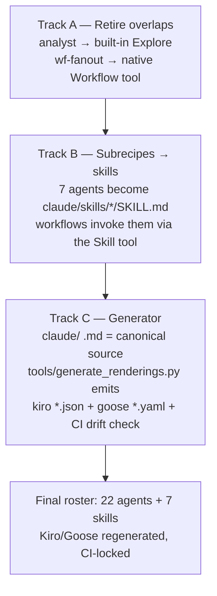

# Phase 3 plan — skills, generator, overlap retirement

**Date:** 2026-08-23 · Decisions confirmed by the user: **full** subrecipes→skills
migration, **build** the Kiro/Goose generator, **retire** the native-overlap pieces.

Execution is ordered by dependency: retirement and migration change the agent
roster, so the generator (which renders that roster) comes last.

## Track A — retire native overlaps

| Retired | Native replacement | Reworked call sites |
|---------|--------------------|---------------------|
| `analyst` agent (all 3 platforms) | built-in **Explore** agent (Claude); direct read-only investigation (Goose) | `wf-understand` (INVESTIGATE/DEEP-DIVE), `wf-migrate` (DISCOVER), `wf-refactor` (optional map), `review-app-feedback` |
| `/wf-fanout` (+ goose rendering) | native **Workflow tool** (say "use a workflow") | `/wf` router row, README/catalog tables |

Analyst's non-negotiables (file:line evidence, observed-vs-inferred labels,
structured report format) move **into the dispatch prompts** of the reworked
workflows, so the quality contract survives the agent's retirement.
Goose `wf-understand/migrate/refactor.yaml` lose their `analyst` sub_recipe and
investigate directly. Tests flip from "analyst installed" to "analyst retired".

## Track B — full subrecipes → skills migration

All 7 subrecipes become **skills** (`claude/skills/<name>/SKILL.md`, directory
name = skill name; description drives auto-invocation):

tdd-generic · language-detection · static-analysis · git-best-practices ·
docker-ml-environment · mlflow-tracking · asana-sync

- Plugin: auto-discovered from `skills/` — no plugin.json change.
- `setup.sh`: install/uninstall `~/.claude/skills/<name>/` (or project `.claude/skills/`),
  removing exactly our 7 on uninstall.
- Workflows: "dispatch the `X` subrecipe" → "invoke the `X` skill (Skill tool) and
  follow it inline"; `Skill` added to every workflow's `allowed-tools`.
  Subagents keep Skill access by default, so `{lang}-expert`s can still load
  `tdd-generic` etc. mid-dispatch.
- Kiro/Goose have no skill primitive → their renderings stay *agents* under
  `subrecipes/`, generated from the SKILL.md canonicals by Track C.
- CONVENTIONS.md §Subrecipes rewritten as §Skills; catalogs updated.

## Track C — single-source generator

**Canonical = the Claude files** (`claude/agents/**/*.md` + `claude/skills/*/SKILL.md`).
No new format: frontmatter + body is already the richest source, and it's the
platform the repo leads with.

`tools/generate_renderings.py` (python3 + PyYAML):

- **Kiro** (`kiro/agents/**.json`): fully regenerated. Mapping: model alias →
  full ID (`opus`→`claude-opus-5`, …); Claude tools → kiro `read`/`shell`/`write`;
  `allowedTools: ["read"]`; body → `prompt`.
- **Goose** (`goose/general/**.yaml`): content-synced, structure-preserved —
  `description` and `instructions` (body, with a parameter-echo header rebuilt
  from the file's own `parameters:`) are regenerated; `parameters`, `activities`,
  `extensions`, `settings`, `prompt`, `title` are preserved from the existing
  file (defaults for brand-new agents). Files with no canonical source
  (goose-only subrecipes, missions, workflows) are never touched or deleted.
- `--check` mode diffs regenerated output against the tree → new CI job
  (`pip install pyyaml`) fails on drift. Contributing docs drop the
  "sync three platforms by hand" rule: edit Claude, run the generator.

## Commits

1. `feat(agents)!: retire analyst + /wf-fanout in favor of native Explore/Workflow`
2. `feat(skills)!: migrate all 7 subrecipes to Claude Code skills`
3. `feat(tools): single-source generator for Kiro/Goose renderings + CI drift check`

Each lands test-first (contract-test assertions flip red → implementation → green);
README counts/badges update in the final commit (30 agents → 22 agents + 7 skills).

## Risks / notes

- Goose workflow YAMLs are hand-maintained; the analyst removal there is a
  minimal edit, not a rework — Goose users lose the dedicated analyst role.
- Generated Goose recipes will normalize wording (e.g. Bash→Shell substitutions);
  hand-tuned phrasing differences inside prompt bodies are overwritten by design.
- `wf-fanout` deletion removes the only Agent-tool parallel-fanout recipe; the
  native Workflow tool requires the user's explicit opt-in phrase ("use a
  workflow") — the router's replacement row says exactly that.
