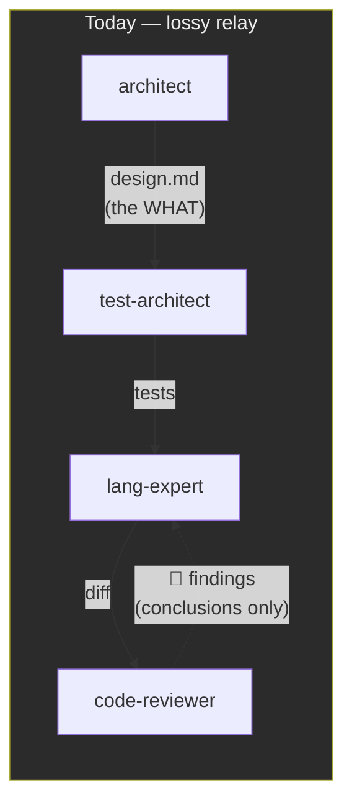
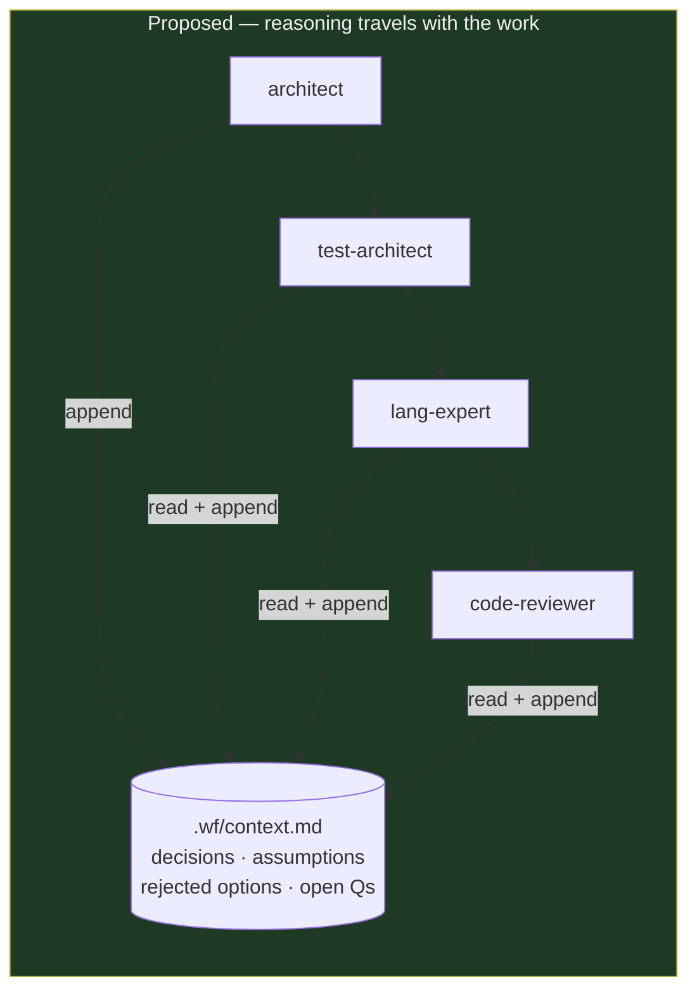
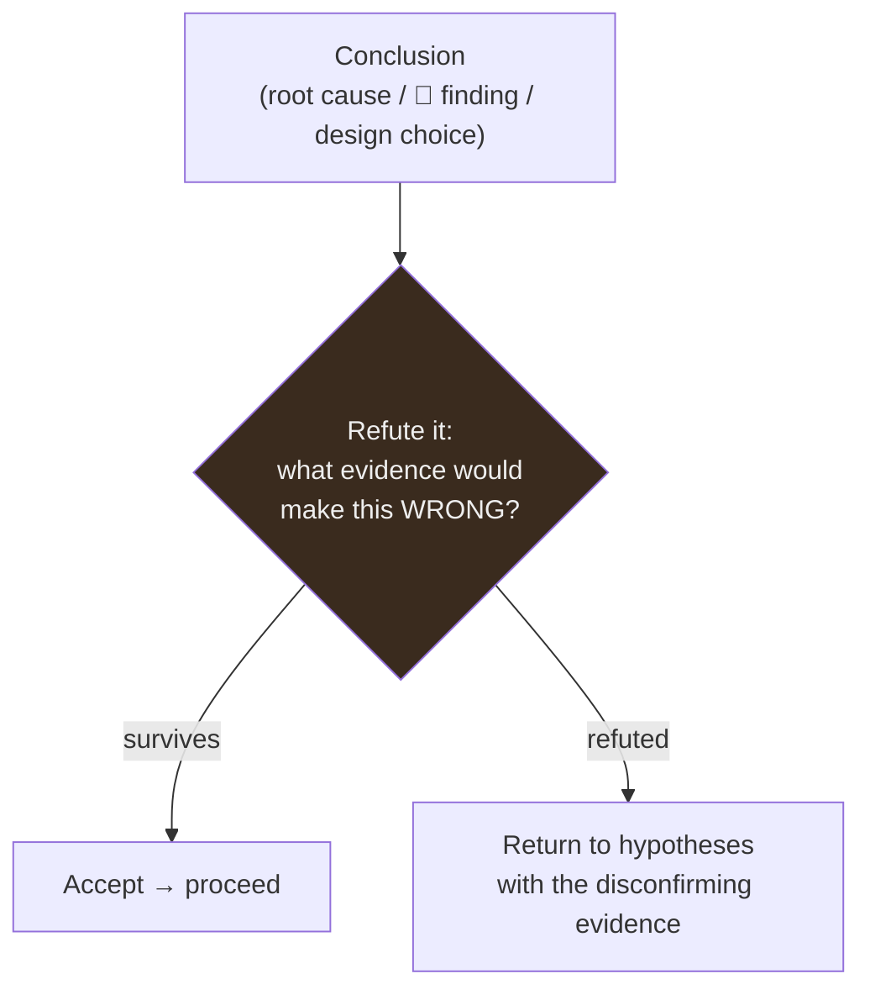
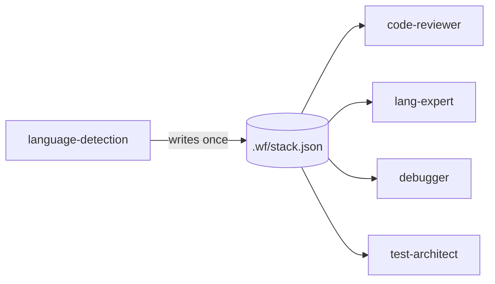
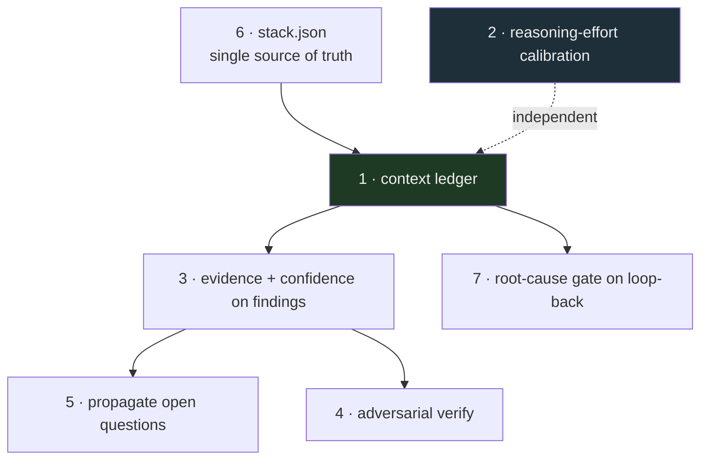

# Improving Reasoning Across Agents

A review of the `agent-recipes` collection focused on one question: **how well do the
agents reason — individually and, more importantly, as a relay where one agent's thinking
must survive the hand-off to the next?**

The collection is already strong on *process* discipline (RED/GREEN identity separation,
evidence-gates, the §1–§9 conventions, bounded loops, a shared severity scale). The gaps
are almost all in **reasoning transfer and reasoning verification** — the seams between
agents, not the agents themselves.

---

## TL;DR — the seven highest-leverage changes

| # | Change | Lever | Effort |
|---|--------|-------|--------|
| 1 | Add a shared **decision & assumption ledger** (`.wf/context.md`) every agent reads + appends | Cross-agent reasoning transfer | M |
| 2 | **Calibrate reasoning effort** — `think`/extended-reasoning directives on the reasoning-heavy phases | Per-agent depth | S |
| 3 | Make findings **carry their evidence + confidence**, not just conclusions | Reasoning survives hand-off | S |
| 4 | Add an **adversarial verify step** for high-stakes conclusions (root cause, security, design choice) | False-positive / false-confidence control | M |
| 5 | **Propagate open questions & ruled-out hypotheses** to resolution instead of dropping them | Uncertainty doesn't evaporate at the seam | S |
| 6 | Persist **project context once** (language-detection → durable artifact) so agents stop re-deriving & drifting | Single source of truth | S |
| 7 | Have the reviewer confirm fixes address the **root cause, not the symptom** on loop-back | Feedback-loop depth | S |

---

## The core problem: reasoning dies at the seam

Today, information flows between agents as **conclusions in prose**, while the *reasoning
that produced them* stays trapped in the agent that's now gone. The next agent re-reads the
codebase and re-derives context from scratch.



Concrete symptoms observed in the recipes:

- **`code-reviewer` re-detects language & re-reads context** (`code-reviewer.md` Step 0)
  even inside `/wf-feature`, where `language-detection` already ran. Two agents can reach
  *different* conclusions (3.10 vs 3.11) with nothing reconciling them.
- **The reviewer never sees the architect's deliberate tradeoffs.** `architect.md` §3
  chooses one option and rejects others *with reasons* — but only the chosen design lands in
  `.wf/design.md`. So the reviewer may flag as a defect something that was a conscious call
  ("why no caching layer here?" — because the architect rejected it for a stated reason the
  reviewer can't see).
- **The GREEN→REVIEW→GREEN loop passes findings as conclusions.** `wf-feature.md` step 5
  hands "the findings" back to the implementer. The implementer inherits *what* is wrong,
  not the reviewer's *reasoning about why* — so it can patch the flagged line while leaving
  the class of bug intact.
- **`debugger.md` ranks and rules out hypotheses** (a genuinely good reasoning structure),
  but the ruled-out set is discarded. The next agent may re-explore a dead branch.

The fix is a **reasoning ledger**: a small, append-only artifact that carries *decisions,
assumptions, rejected options, and open questions* alongside the code artifacts.



### Recommendation 1 — a shared decision & assumption ledger

Add one convention (`CONVENTIONS.md` §10) and one file. Every workflow agent reads
`.wf/context.md` on entry and appends its durable reasoning on exit. Suggested shape:

```markdown
# Context Ledger — <feature>

## Decisions (with rationale)
- [architect] Chose event-bus over direct calls — decouples X from Y; rejected direct
  calls (tighter coupling) and polling (latency). Revisit if throughput < N.

## Assumptions (challengeable by any later agent)
- [architect] Input list fits in memory (< 10k items per PRD). — UNVERIFIED
- [lang-expert] Upstream never sends null email. — VERIFIED by test_x

## Rejected options (don't re-explore)
- [debugger] Token expiry — refuted: token valid at failure time (logged iat/exp).

## Open questions (must be resolved before REPORT)
- [ ] Rate-limit window: per-user or per-IP? (blocks security review)
```

Payoff: the reviewer stops flagging deliberate choices; the implementer inherits the
*why*; no agent re-explores a ruled-out branch; assumptions become visible enough to be
challenged. This is the single biggest reasoning-transfer win and it's cheap — it's a
documentation convention, not new machinery. (`.wf/` already exists as the hand-off
channel; this extends it from *artifacts* to *reasoning*.)

---

## Recommendation 2 — calibrate reasoning effort to the task

Model tiers are already partly calibrated (haiku for mechanical subrecipes, opus for
`ai-researcher`, sonnet elsewhere). But **no agent uses an explicit reasoning/thinking
directive**, and the reasoning-heaviest agents — `architect`, `debugger` (root-cause),
`security-auditor`, `code-reviewer` — sit at plain sonnet with no cue to think deeply
before answering.

Two low-effort changes:

- **Add an explicit "reason before you answer" directive** to the analysis-heavy agents.
  E.g. in `debugger.md` Phase 2 and `architect.md` §3, instruct the agent to *think through
  the competing options / disconfirming evidence before committing*. On models with a
  thinking budget this measurably improves root-cause and design quality.
- **Document a reasoning-effort tier in frontmatter** alongside `model:` so the calibration
  is explicit and reviewable, e.g. a comment or a convention that maps phase → effort:

  | Phase / agent | Effort | Why |
  |---|---|---|
  | language-detection, static-analysis, git | low | mechanical, deterministic |
  | lang-expert GREEN, documentation | medium | bounded by tests / templates |
  | architect, debugger root-cause, security-auditor, design-choice review | high | open-ended, high blast radius |

This makes "how hard should this agent think" a **declared, tunable property** rather than
an accident of the default.

---

## Recommendation 3 — findings must carry evidence + confidence

`code-reviewer.md`'s output is `[file:line] — [description + suggested fix]`. That's a
conclusion. The downstream fixer (and the human) can't tell a *certain* bug from a
*suspected* one, and can't check the reasoning. Add two fields to every finding:

```
## 🔴 Critical
- src/auth/handler.py:45 — SQL injection via string interpolation
  Evidence: `f"... WHERE id = {user_id}"` with user_id from request.args (untrusted, line 41)
  Confidence: High — reproduced mentally; user_id is unsanitized on this path
  Fix: parameterize — `cur.execute("... WHERE id = %s", (user_id,))`
```

Same pattern for `debugger` (it half-does this already with its Evidence Path) and
`security-auditor`. Payoff: downstream agents inherit a **checkable reasoning trace**, not
a verdict; low-confidence findings get verified rather than blindly "fixed"; false positives
are visible as low-confidence and don't trigger churn.

---

## Recommendation 4 — adversarial verification for high-stakes conclusions

Every gate today checks an **output** (tests pass, no 🔴, benchmark beats threshold). None
checks the **reasoning**. A confidently-wrong root cause or a plausible-but-false security
finding sails through. Add a lightweight *refutation* step where the stakes are highest:



Cheapest form: a self-critique instruction inside the existing agent —
*"Before you commit to this root cause / finding, state the single strongest piece of
evidence that would prove you wrong, and confirm it's absent."* Add to:

- `debugger.md` Phase 3 (before "Confirmed → proceed to fix").
- `security-auditor` and `code-reviewer` before emitting each 🔴.
- `architect.md` §3 before finalizing the chosen approach.

Stronger form (for `/wf-*` orchestration): dispatch a **separate** skeptic agent to try to
refute the finding — the same identity-separation principle that already makes RED/GREEN
work, applied to reasoning. Worth it for `/wf-release` and `/wf-db-change`, where a wrong
call is expensive.

---

## Recommendation 5 — propagate uncertainty to resolution

`architect.md` ends with "Open Questions" and §6 says "state assumptions and default" — but
nothing tracks those to closure. An open question raised at DESIGN can silently die before
REPORT. Wire the ledger (Rec 1) into the gates:

- Any `[ ]` open question in `.wf/context.md` that's still open at REPORT is surfaced to the
  user, not dropped.
- `wf-spec.md`'s DESIGN gate ("must cover every acceptance criterion") gains a sibling:
  *"every open question is either resolved or explicitly deferred with an owner."*

Payoff: uncertainty is a first-class, tracked object instead of evaporating at the seam
between two agents.

---

## Recommendation 6 — establish project context once, reuse it

`language-detection` runs inside workflows but its output isn't persisted as a durable
artifact — so `code-reviewer` Step 0, each language expert, and the debugger all
independently re-derive the stack, and can drift. Have `language-detection` write
`.wf/stack.json` (language, version, framework, exact test/lint commands), and have every
downstream agent **read it instead of re-detecting**. One source of truth → no drift, less
redundant reasoning, faster runs.



---

## Recommendation 7 — reviewer confirms root-cause, not symptom, on loop-back

In the REVIEW→GREEN→REVIEW loop (`wf-feature.md` step 5, `wf-bugfix`), the re-review only
re-checks that findings are gone. Add one reasoning check to the loop: *"confirm the fix
addresses the underlying cause the finding pointed at, not merely the flagged line — check
for the same class of issue elsewhere."* `debugger.md` Phase 5 already has "Check for
similar patterns elsewhere"; promote that from a per-agent habit to a **gate condition** in
the looping workflows so the same bug class can't survive by whack-a-mole.

---

## What's already good (keep it)

- **Identity-based RED/GREEN separation** — the test author and implementer being
  *different agents* is exactly the right way to stop reasoning bias. Recs 4 apply the same
  principle to verification.
- **Evidence-gates over claim-gates** — "won't advance on a claim, only a checked result"
  (README) is the right spine; the recs above extend gating from outputs to reasoning.
- **Scientific debugging with ranked hypotheses** — strong structure; just stop discarding
  the ruled-out set (Rec 1) and add refutation (Rec 4).
- **§8 YAGNI / §7 surgical diffs / §9 bounded loops** — these keep reasoning grounded and
  prevent runaway loops. Don't dilute them.

---

## Suggested rollout order



1. **Rec 6 + Rec 2** first — smallest, independent, immediate payoff (no drift; deeper
   thinking where it counts).
2. **Rec 1** (the ledger) — the keystone; Recs 3/5/7 all build on it.
3. **Rec 3 → 5 → 7** — enrich what flows through the ledger.
4. **Rec 4** last — highest value but most involved; layer it once findings carry evidence.

Each is a small edit to `CONVENTIONS.md` plus the affected agent/workflow files, mirrored
into the Goose (YAML) and Kiro (JSON) renderings to keep the three platforms in parity.
