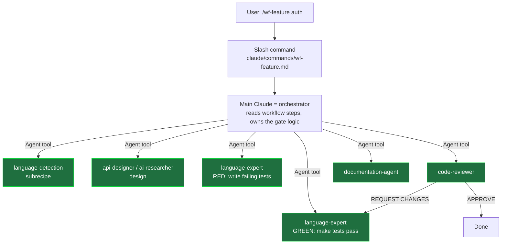
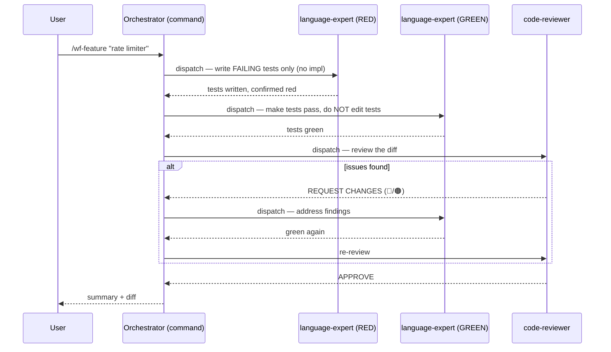
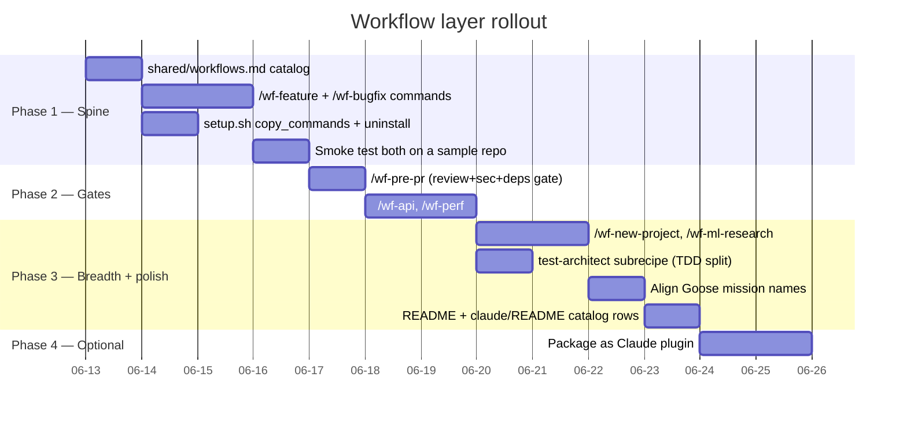

# Plan: Add a Workflow Layer to agent-recipes

> Goal: give agent-recipes multi-step, multi-agent **workflows** for Claude Code —
> the orchestration layer it currently lacks — without adopting Tobmenne's heavier
> SOP/specs/build-script machinery.

## Guiding principle

**Workflows are thin sequencers; agents hold the knowledge.**

agent-recipes already has well-factored, single-responsibility agents
(`code-reviewer`, `debugger`, language experts, subrecipes, …). A workflow does
not re-explain *how* to review or *how* to debug — it just **sequences existing
agents** and defines the hand-offs, gates, and stop conditions between them. This
is the opposite of duplicating role logic and is what keeps the layer lightweight.

In Claude Code the idiomatic home for this is a **slash command** that uses the
`Agent` tool to dispatch the already-installed subagents. (Tobmenne proves the
mapping: each SOP → a `commands/*.md` slash command, each role → a subagent.)

```
SOP / mission      →  slash command   (claude/commands/*.md)
role / specialist  →  subagent        (claude/agents/*.md)   ← already exist
persistent state   →  optional specs/ folder (off by default)
```

## Architecture



Green nodes already exist — the workflow only adds the orchestration arrows.

### Example: `/wf-feature` sequence



> **TDD agent separation note.** Your global rule (and Tobmenne's qa-engineer /
> developer split) requires the test author and the implementer to be *different*
> agents. agent-recipes has no `qa-engineer`. Two options:
> 1. **(Now)** Dispatch the *same* language-expert twice with role-constrained task
>    files: pass #1 = "write only failing tests, no implementation"; pass #2 =
>    "make tests pass, you may NOT edit test files". The constraint, not the
>    identity, enforces separation.
> 2. **(Better, optional)** Add a `test-architect` subrecipe/agent so the RED and
>    GREEN phases are genuinely distinct identities. Recommended follow-up.

## Directory layout (additions only)

```
agent-recipes/
├── claude/
│   ├── agents/                    # unchanged (the reusable units)
│   └── commands/                  # NEW — workflow slash commands
│       ├── wf-feature.md
│       ├── wf-bugfix.md
│       ├── wf-pre-pr.md
│       ├── wf-api.md
│       ├── wf-perf.md
│       ├── wf-new-project.md
│       └── wf-ml-research.md
├── goose/
│   └── coding_agent_context/
│       └── missions/              # already the Goose equivalent — keep in sync
├── shared/
│   └── workflows.md               # NEW — canonical workflow catalog (doc, not code)
└── docs/
    └── workflows-plan.md          # this file
```

## Command anatomy (self-contained, no external file deps)

Each command is small and embeds its own step list so it works whether installed
user-level (`~/.claude/commands/`) or project-level. Skeleton:

```markdown
---
description: "Feature via TDD: design → red → green → review → docs"
argument-hint: "<feature description>"
allowed-tools: Bash, Read, Write, Glob, Grep, Agent
---

# Workflow: Feature (TDD)

**Feature:** $ARGUMENTS

You are the orchestrator. You do NOT write code yourself — you dispatch the
specialist subagents below via the `Agent` tool, one phase at a time, and you own
the gate between phases.

## Subagents you will dispatch
- language-detection (subrecipe) — identify stack
- {language}-expert — RED then GREEN (separate dispatches, constrained)
- code-reviewer — quality/security/perf gate
- documentation-agent — docs + changelog

## Steps
1. DETECT: dispatch language-detection → record stack.
2. RED: dispatch the matching language-expert with "write only failing tests".
   Verify the tests fail before continuing.
3. GREEN: dispatch the language-expert with "make tests pass, do not edit tests".
4. REVIEW: dispatch code-reviewer on the diff. If REQUEST CHANGES, loop to GREEN.
5. DOCS: dispatch documentation-agent.
6. Summarize the diff and the review verdict for the user.
```

### Optional lightweight state (off by default)

If a workflow is long or resumable, it may write to `.agent-workflows/<feature>/`
(`plan.md`, `progress.md`). This is a convention, not a requirement — no second
brain, no `BRAIN_CONFIG.yaml`. Add a `.gitignore` entry for `.agent-workflows/`.

## Seed workflow set

All map onto **existing** agents/subrecipes — nothing new required (except the
optional `test-architect`).

| Command | Sequence of existing agents | Gate / loop |
|---|---|---|
| `/wf-feature` | language-detection → (api-designer \| ai-researcher) → {lang}-expert RED → {lang}-expert GREEN → code-reviewer → documentation-agent | review loops back to GREEN |
| `/wf-bugfix` | debugger (writes regression test, RED) → {lang}-expert (GREEN) → code-reviewer | review loops to GREEN |
| `/wf-pre-pr` | static-analysis → code-reviewer → security-auditor → dependency-auditor | any 🔴 blocks; emit gate report |
| `/wf-api` | api-designer → {lang}-expert (implement) → code-reviewer → documentation-agent | review loop |
| `/wf-perf` | performance-optimizer (measure) → {lang}-expert (optimize) → code-reviewer | re-measure must beat baseline |
| `/wf-new-project` | project-bootstrapper → {lang}-expert → documentation-agent | — |
| `/wf-ml-research` | ai-researcher → docker-ml-environment → mlflow-tracking | — |

## setup.sh integration

Add a `copy_commands()` mirroring `copy_agents()`, and wire it into the existing
flags so commands install alongside agents:

- `--claude` → also `cp claude/commands/*.md ~/.claude/commands/`
- `--claude-project` → also `cp claude/commands/*.md .claude/commands/`
- `--uninstall` → also remove installed `wf-*.md`
- Goose already loads missions via `GOOSE_RECIPE_PATH` — no change needed.

(One naming guard: prefix all commands `wf-` so uninstall can target them
precisely and they don't collide with the user's own commands.)

## Multi-platform parity

| Platform | Workflow mechanism | Action |
|---|---|---|
| Claude Code | `claude/commands/wf-*.md` (NEW) | build this |
| Goose | `coding_agent_context/missions/*.md` + recipes | already exists — align names |
| Kiro | agent JSON only | document as "agents, no native workflow"; defer |

To avoid the three-copy drift the README already warns about: treat
`shared/workflows.md` as the **single human-readable catalog** (one row per
workflow: purpose, agent sequence, gates). Claude commands and Goose missions are
thin renderings of it. **No Python build script** — that's the line we don't cross
to stay in the lightweight lane (porting the generator is the "full Tobmenne"
option you declined).

## Rollout (phased, TDD-checked)



## Open decision: distribution format

| Option | Pros | Cons | Recommendation |
|---|---|---|---|
| **A. Plain `commands/` dir** (copied by setup.sh, like agents today) | Zero new concepts; consistent with current install; works user- & project-level | Commands + agents installed as two separate copies | **Start here** (Phases 1–3) |
| **B. Claude plugin** (`.claude-plugin/plugin.json` bundling agents + commands) | Single portable unit; `--plugin-dir` or marketplace install; bundled paths resolve; matches Tobmenne | New packaging concept; another platform-specific artifact to maintain | **Phase 4**, once workflows stabilize |

## Verification (per global rules)

Each workflow command is validated by running it end-to-end against a throwaway
sample repo and asserting the observable contract:
- `/wf-feature` leaves the suite **green** and produces a code-reviewer verdict.
- `/wf-bugfix` adds a regression test that was **red before, green after**.
- `/wf-pre-pr` **blocks** when a seeded 🔴 (e.g. hardcoded secret) is present and
  **passes** when it is not.

No workflow is marked done until its smoke test is demonstrated, not assumed.

## Explicitly out of scope

- Second Brain / `BRAIN_CONFIG.yaml` (Tobmenne-specific).
- Python build-script config generation.
- Mandatory persistent `specs/` state.
- Admin workflows (slides, meeting notes, wiki) — agent-recipes stays engineering-only.
```
